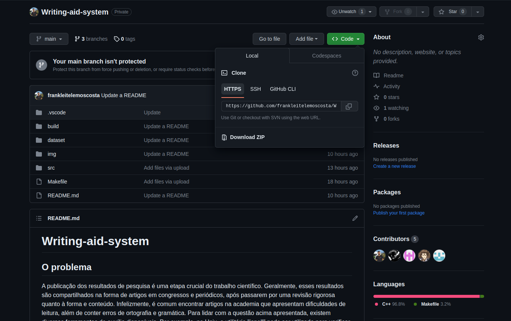

# TOP-K-ITENS

## O PROBLEMA

Um exemplo clássico de problema que pode ser solucionado utilizando-se hash e heap é o
chamado top k itens. Se trata dos k itens mais recorrentes, para tal foi proposto realizar tal 
tarefa desta forma:
• Crie uma tabela de dispersão (hash) para contar a frequência de cada elemento tok-
enizado da coleção de dados de entrada.
• Crie uma árvore de prioridades (heap) de tamanho k e insira os primeiros k elementos do
hash nela.
Estes são os desafios para resolução do problema. 

## OBS/ATTENTION!

Todos os comentarios, alem das variaveis e nome de funções estão escritas na lingua inglesa, com o objetivo de trazer mais inclusão para que qualquer pessoa seja capaz de entender toda codificação.

All coments, variables and function names is write in english with the goat of more people read and understand the code. 

## FASES DE ESPECIFICAÇÃO, PROJETO E IMPLEMENTAÇÃO

Primeiramente para começar a extrair os dados dos varios arquivos de entrada foi utilizado  um contador para contar dentro do loop onde esta ocorrendo o caminhamento letra a letra do arquivo de entrada para que fosse possível concatenar as palavras e formar o nome de cada arquivo, a lógica é converter o inteiro em string e concatenar com o resto do nome que será padrão para a qualquer arquivo que entre no dataset como arquivo de entrada,o padrão de nomeação destes arquivos são: txt01, txt02, e assim sucessivamente, observe que foram definidos apenas dois textos de entrada, para adicionar mais textos a serem processados basta alterar no arquivo Analysis o desvio condicional onde se chama o métod getText dentro do loop while(*ch). Era necessário extrair os dados e coloca-los na memória para serem processados e adicionados a estrutura de dados conhecida como tabela de dispersão ou Hash. Para tal requisito foi utilizado o modo de leitura das linguagens utilizadas neste projeto(C e C++) com a biblioteca fstream e como modo de leitura foi utilizado a função wifstream no modo binário, tal função requer apenas o endereço do arquivo a ser lido e o modo de leitura. assim foi adicionado a uma variavela qual foi denominada de buffer neste projeto, e posteriormente seu valor foi retornado a outra que se encontrava no trecho do código onde ocorreu a análise dos dados do arquivo, cujo nome é Analysis, tal função é chamada na função principal da aplicação, que é o marco de inicio de todos os procedimento para cumprir com o objetivo principal do projeto o de fazer um analisador de recorrência de palavras em um texto.

Tendo os dados a dispozição para processamento na memoria foi necessário decidir qual estrutura de dados utilizar para armazenar os dados, e alem disso como identificar onde o buffer se encontrava a medida que fosse percorrido letra a letra do arquivo de entrada. Para armazenar as palavras do arquivo de entrada foi utilizado a tabela de dispersão hash, pois a mesma usa como indereçamento uma chave o que facilita a pesquisa, cujo custo computacional é O(1), assim a medida que ocorreu a repetição das palavras no texto foi facil localizar tal palavra na estrutura de dados e contar sua frequencia o qual se faz o principal objetivo. Para realizar a identificação de onde o buffer se encontrava foi utilizado as seguintes considerações:

* Este programa deverá ler uma coleção de arquivos contento textos sem nenhuma for-
matação ("arquivo ASCII") onde cada sentença termina por um sinal de pontuação (".",
"?", "!"").
* Cada parágrafo é separado por, pelo menos, uma linha em branco.
* Considere como palavra uma sequência de letras delimitada por espaço em branco, ”col-
una da esquerda”, ”coluna da direita” e símbolos de pontuação.

Assim quando foi identificado que a variavel com os dados do texto de entrada estava em alguma destas situações a palavra já estava em uma outra variável que foi sendo concatenada letra a letra a cada vez que o loop de leitura foi ocorrendo. A motivação do uso da linguagem C++ neste projeto também se faz mais significativa neste momomento da discução visto que a concatenação de uma string na mesma é mais simples que na linguagem C, e a cada vez que isso ocorria foi sendo adicionado a palavra a estrutura e assim foi até o fim do texto, após o término do processamento do texto por completo a tabela de dispersão continha as k palavras mais recorrentes, porem com isso surge outro entrave, como saber em meio a milhares de palavras quais são as mais recorrentes?, a resposta é: basta ordenar os dados em ordem crescente, para tal tarefa foi utilizado a árvore de prioridade ou árvore Heap, a motivação é simples o custo de ordenação com outra estrutura não se compara ao do método Heap sort, que tem o custo computacional O(log(n)).

## EXEMPLO DE ENTRADA E SAÍDA

## INSTRUÇÕES DE COMPILAÇÃO

Para obter este projeto em sua máquina basta usar o comando no terminal: git clone "link https no topo do repositóiro", tal link esta no topo da página na tag code como mostra a imagem abaixo:

Este projeto contem um arquivo com um conjunto de diretivas de compilação que podem ser executadas em terminal, as quais são:

<table border="1">
      <tr><td><u>g++ (nome dos arquivos) -o  (nome do executável)</u></td></tr>
      <tr><td><u>rm -rf (nome do executável)</u></td></tr>
      <tr><td><u>./(nome do executável)</u></td></tr>
</table>

    <i>As diretrizes de execução deste Make file são:<i>
    <table border="1">
      <tr><td><u>make clean</u></td> <td>Apaga a última compilação realizada contida na pasta objects</td></tr>
      <tr><td><u>make</u></td> <td>Executa a compilação do programa utilizando o g++, e o resultado vai para a pasta objects que esta dentro do repositório build.</td></tr>
      <tr><td><u>make run</u></td> <td>Executa o programa da pasta objects após o programa já estar compilado </td></tr>
    </table>
    <i>Para a execução do programa utilize <u>make</u> para realizar a compilação e logo após utilize <u>make run</u> para executar o programa</i>

## MÁQUINA DE TESTE

<table style="width: 100%;" border="1">
        <tr align="center" >
            <td colspan="2">
                

                         
                        
Notebook 550XDA Sansung

                                 
                

            </td>
        <tr>
        <tr align="center">
            <td>
               

                     
                    
RAM

                     
               
 
            </td>
            <td >
                 
                    
8Gb DDR4

                 
            </td>
        </tr>
        <tr align="center">
            <td style="width: 20%;">
                

                     
                    
SO

                     
                

            </td>
            <td >
                 
                    
Linux Ubuntu v22.04, 64bits

                 
            </td>
        </tr>
        <tr align="center">
            <td style="width: 20%;">
                 
                    
    
                        CPU
                    

                 
            </td>
            <td >
                 
                    
Intel core i5 11° geração 2,40GHz

                 
            </td>
        </tr>
    </table>

## AUTOR

Frank Leite Lemos Costa. Aluno de Engenharia da Computação no <a href = "https://www.cefetmg.br/">CEFET</a>, 4° período.

